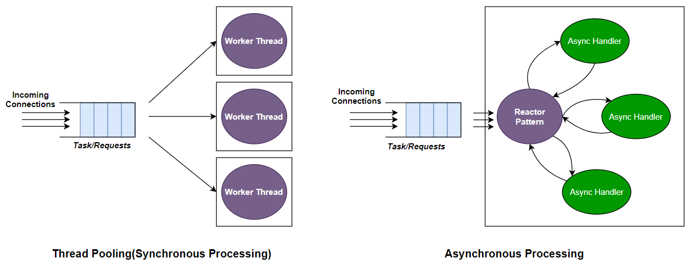
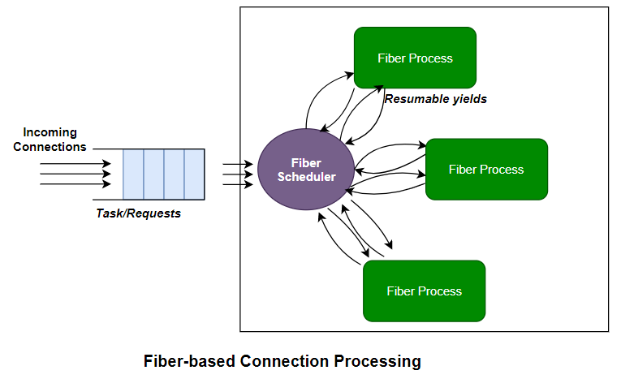

## Typical Server Designs
Common programming model for implementing HTTP-based service or network programming in general use either synchronous and asynchronous programming model.

### Synchronous programming model using thread pool
One aspect of synchronous programming is the easiness to reasond and code of program flow. No callback hell, no need to maintain state machine, easy to handle exception or error and other conveniences.

Synchronous network programming using a thread pool is an approach that blends synchronous interface with the efficiency and scalability of a thread pool. It's widely used in scenarios where applications must handle multiple network connections concurrently, such as servers. However, it's crucial to understand that while this approach offers advantages, it comes with significant drawbacks.

How it works:

1. Thread Pool Setup: A fixed number of threads are allocated to create a thread pool. This is designed to efficiently manage incoming network requests without overloading the system.

2. Blocking I/O Operations: Network operations, like reading from or writing to sockets, are inherently blocking. They pause the program's execution until the operation is finished. In synchronous network programming, these operations are carried out in a blocking manner.

3. Thread Assignment: When a network operation is initiated, it's assigned to one of the threads in the pool. This thread blocks, waiting for the operation to complete.

4. Concurrency Management: The thread pool ensures that no more than a specific number of threads are simultaneously involved in I/O operations. This leaves other threads available for new requests.

5. Efficiency and Scalability: The thread pool minimizes the overhead of creating and destroying threads for every new network request, improving resource utilization and scalability.

Drawbacks:

1. Blocking Delays: The most significant drawback is blocking. Threads waiting for I/O operations to complete can lead to significant delays in the application's responsiveness, especially when handling multiple clients. Long-running or stalled I/O operations can impact the entire system's performance.

2. Resource Consumption: Maintaining a thread pool with a substantial number of threads can consume a significant amount of system resources, and managing those resources efficiently can be complex.

3. Complexity and Bugs: Managing synchronization and coordination between threads can be intricate. The more threads involved, the greater the risk of synchronization-related bugs, which can be challenging to debug.

4. Scalability Limitations: Thread pools have an upper limit on scalability. Adding more threads may alleviate blocking issues to some extent, but beyond a certain point, it can lead to diminishing returns and increased resource contention.

5. Not Ideal for High-Concurrency Scenarios: In scenarios with extremely high levels of concurrent network requests, a thread pool with a synchronous approach may not be the most efficient choice. Imagine if you want to build Websocket service with that have a long connection cycle, "borrowing" thread from the thread pool to handle this connection will not possible and will starve the pool very quickly.

6. Performance Variability: Thread pools' performance can vary significantly depending on factors like the number of threads, workload, and I/O characteristics, making it challenging to predict performance under varying conditions.

For scenarios requiring high concurrency and responsiveness, alternative approaches such as asynchronous programming models or event-driven architectures may be more suitable.

### Asynchronous programming model
Asynchronous network programming is an approach that allows an application to perform network operations without waiting for each operation to complete before moving on to the next task. It utilizes non-blocking I/O operations and callback mechanisms to enable an application to initiate multiple network requests and then continue processing other tasks while awaiting responses.

**How it works:**
 1. Non-blocking I/O: In asynchronous programming, I/O operations are non-blocking, meaning the application can continue executing other tasks without waiting for the operation to finish. When the operation completes, the application is notified.

 2. Callback Mechanisms: Callback functions or event handlers are used to specify what should happen when an I/O operation completes. This allows the application to respond to events, such as data arrival or a connection being established, without blocking its main thread.

 3. Concurrency and Parallelism: Asynchronous programming enables a high level of concurrency, allowing many network operations to proceed in parallel, even within a single-threaded application.

**Advantages:**
 1. Improved Responsiveness: Asynchronous programming ensures that an application remains responsive, even when dealing with multiple network operations.
 2. High Concurrency: It efficiently handles a large number of concurrent network requests, making it suitable for high-throughput scenarios.
 3. Resource Efficiency: It minimizes resource overhead by not blocking threads during I/O operations.

**Drawbacks:**
 1. Complexity: Asynchronous programming introduces complexities due to callback-based event handling and the need to manage asynchronous control flow.
 2. Callback Hell: Excessive nesting of callbacks, also known as "Callback Hell" or "Pyramid of Doom," can make code less readable and harder to maintain.
 3. Debugging Challenges: Debugging asynchronous code can be more complex because it's harder to trace the sequence of events and pinpoint issues.
 4. Synchronization Issues: Proper synchronization of shared data in asynchronous programs can be challenging, potentially leading to race conditions and other synchronization-related bugs.

## Fiber-based Design

Libasyik employs a concurrent programming model where tasks are created and initiated akin to multi-threaded(synchronous) programs. However, it distinguishes itself in the following ways:
 - No reliance on a kernel scheduler, eliminating the need for costly context switching. Scheduling is managed within the application context.
 - Fibers are significantly lighter than threads, allowing for the concurrent operation of numerous fibers with minimal overhead.
 - Unlike threads, which rely on time-sliced execution, fibers only transfer control explicitly through designated fiber-enabled functions or APIs.
 - Multiple fibers can seamlessly run within a single thread (1:N), reducing the necessity for synchronization mechanisms like mutexes when accessing shared variables

In sum, fiber combine the simplicity on managing program flow similar to synchronous programming model, while have high concurrency and performance benefit of the asynchronous network programming model